# Sign-Bot: Software Architecture & Engineering Documentation
## Arabic Sign Language Recognition System for Raspberry Pi 4

This document compiles the comprehensive software architecture and technical documentation for **Sign-Bot**, an Arabic Sign Language recognition system deployed on a Raspberry Pi 4. The documentation is derived strictly from the actual system implementation and verified codebase.

---

## 1. High-Level System Architecture (Artifact 1)

The High-Level System Architecture coordinates two distinct operating phases: **Training Pipeline** (run on high-compute GPU environments like Google Colab to build and export weights) and the **Inference Pipeline** (run locally in real-time on a Raspberry Pi 4 microcontroller or local Mac platform).

Both phases share a unified **Preprocessing Module** (`preprocessing.py`) to prevent feature representation drift, which was a critical bug in earlier revisions of the project.

### Mermaid Diagram
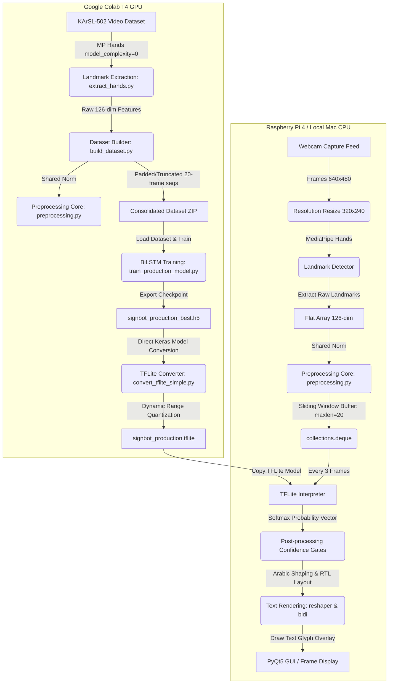

### Architectural Narration
1. **Video/Frame Acquisition**: Video sequences are resized to a target size of $320 \times 240$ pixels before entering landmark extraction. This matches the native processing resolution of the Raspberry Pi camera module, ensuring spatial scale consistency.
2. **Feature Extraction**: Landmark detection is delegated to **MediaPipe Hands** (complexity level 0 for low CPU latency). It yields $21$ keypoints per hand in 3D coordinates ($X, Y, Z$). Across both hands (Left and Right), this compiles a $126$-dimensional vector per frame.
3. **Core Preprocessing**: The $126$-dim feature vector is passed to the shared `preprocessing.py` component. It translates coordinates relative to the wrist (Origin $[0,0,0]$) and scales them by the maximum Euclidean distance to make landmarks translation- and scale-invariant.
4. **Temporal Classification**: At runtime, normalized landmarks are fed into a sliding window queue (buffer depth $= 20$). Every 3 frames, the $20 \times 126$ sequence is evaluated by the TFLite Interpreter.
5. **Arabic Rendering**: The predicted class is reshaped for correct Arabic letter connections, structured RTL (Right-to-Left), and overlaid on the GUI frame using PIL.

---

## 2. Software Module Architecture (Artifact 2)

The modular design segregates configuration parameters, feature extraction routines, model builders, conversion tools, and live testing modules.

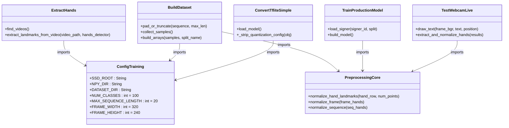

### Module Descriptions
- **Preprocessing Core (`preprocessing.py`)**: Extensively used by both training-side dataset compilers and deployment-side inference scripts. Normalizes $(x, y, z)$ hand coordinates.
- **Dataset Configuration (`config_training.py`)**: Central repository of parameters (complexity thresholds, frame sizes, random seed).
- **Landmark Extractor (`extract_hands.py`)**: Walks raw KArSL MP4 structures, initializes a fresh MediaPipe Hands detector per file to block tracking state bleed, and outputs `.npy` arrays.
- **Dataset Builder (`build_dataset.py` / `build_dataset_with_statistics.py`)**: Normalizes, pads/truncates, splits 15% stratified validation data, packages files for cloud training, and produces figures.
- **Training Hub (`train_model.py` / `train_production_model.py` / `loso_cross_validation.py`)**: Trains the BiLSTM network on Colab GPU with early stopping, saving weights to `.h5` format.
- **TFLite Conversion (`convert_tflite_simple.py`)**: Patches Keras compatibility flags, verifies weights directly using dummy data accuracy, converts via `from_keras_model`, and exports `.tflite`.
- **Runtime Validation (`test_webcam_live.py`)**: Evaluates model performance using a local USB/webcam stream with real-time bidi Arabic overlay rendering.

---

## 3. Runtime Flowchart (Artifact 3)

The operational logic inside the real-time loop of the Raspberry Pi deployment (and pre-flight Mac test script `test_webcam_live.py`) handles frames sequentially.

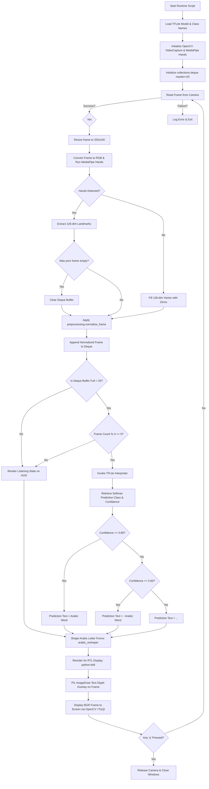

---

## 4. Machine Learning Pipeline (Artifact 4)

The ML pipeline spans data extraction, engineering, model training, cross-validation, model conversion, and local evaluation.

```mermaid
graph LR
    %% Data Engineering
    subgraph Data Engineering
        A[KArSL MP4 Videos] -->|MediaPipe Hands| B[Raw Landmarks *.npy]
        B -->|Translate wrist to 0| C[Normalized Landmarks]
        B -->|Scale by max distance| C
        C -->|Pad or Truncate| D[Fixed 20-frame Sequences]
    end

    %% Split & Validation
    subgraph Split & Validation
        D -->|Baseline & Production| E[15% Stratified Val Split]
        D -->|Leave-One-Signer-Out| F[Train folds on 2 signers / test on 1]
    end

    %% Model Training
    subgraph Deep Learning Model
        E -->|Input shape 20, 126| G[Keras Masking Layer]
        G -->|Ignore pad frames| H[Bidirectional LSTM 128 units]
        H -->|Dropout 0.3| I[Bidirectional LSTM 64 units]
        I -->|Dropout 0.3| J[Dense ReLU 64]
        J -->|Softmax Output| K[Dense Softmax 100 classes]
    end

    %% Export & Quantization
    subgraph Export & Quantization
        K -->|Train Epochs 100 / Early Stopping| L[signbot_production_best.h5]
        L -->|Direct Keras Model Tracing| M[TFLiteConverter.from_keras_model]
        M -->|Select TF Ops Flex Delegate| N[TFLite Dynamic Range Quantization]
        N -->|Verify Weight prediction diff < 1e-3| O[signbot_production.tflite]
    end
```

---

## 5. Sequence Diagram (Artifact 5)

This sequence diagram maps the temporal interactions and operational dependencies during real-time runtime webcam processing and inference.

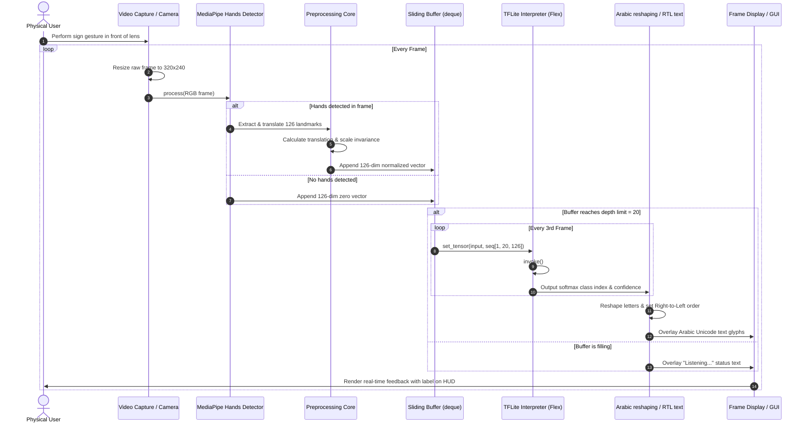

---

## 6. Component Description Table (Artifact 6)

The following table catalogs every script and configuration file within the Sign-Bot pipeline.

| Filename | Platform / Runtime | Inputs | Outputs | Core Architectural Role |
| :--- | :--- | :--- | :--- | :--- |
| **`config_training.py`** | Local / Colab | Static settings | Python variables | Single source of truth for global configuration parameters. |
| **`preprocessing.py`** | Shared Core | Flat 126-dim array | Normalized 126-dim array | Translates coords relative to wrist and scales by max Euclidean distance. |
| **`extract_hands.py`** | Local Mac CPU | KArSL raw MP4s | Per-video `.npy` files | Extracts hand keypoints with MediaPipe Hands (complexity=0). |
| **`build_dataset.py`** | Local Mac CPU | Extracted `.npy` folders | `signbot_colab_package.zip` | Pads/truncates sequences and splits validation data. |
| **`build_dataset_with_statistics.py`**| Local Mac CPU | Extracted `.npy` folders | `signbot_colab_package.zip` & PNGs | Generates data statistics reports and distribution figures. |
| **`train_model.py`** | Google Colab GPU | `signbot_colab_package.zip` | `signbot_arabic_v3_best.h5` | Trains the baseline model using a validation split callback. |
| **`loso_cross_validation.py`** | Google Colab GPU | `signbot_colab_package_loso.zip` | Fold accuracy & summary txt | Evaluates cross-signer generalization (Fold 1–3). |
| **`train_production_model.py`** | Google Colab GPU | `signbot_colab_package_loso.zip` | `signbot_production_best.h5` | Trains the final deployment model on all signers combined. |
| **`convert_tflite_simple.py`** | Local Mac CPU | `signbot_production_best.h5` | `signbot_production.tflite` | Patches Keras config schema and converts to quantized TFLite. |
| **`test_tflite_real_data.py`** | Local Mac CPU | `signbot_production.tflite` | Accuracy classification report | Validates exported models using real test data arrays. |
| **`test_webcam_live.py`** | Local Mac CPU | `signbot_production.tflite` | BGR UI display frame | Real-time Mac webcam diagnostic loop with Arabic text render. |

---

## 7. Directory Structure (Artifact 7)

```text
signbot_pipeline/
├── config_training.py                # Central pipeline parameters
├── preprocessing.py                  # Shared translation/scale normalization
├── extract_hands.py                  # MediaPipe landmark extraction (hands only)
├── build_dataset.py                  # Normalization, padding/truncation, validation split
├── build_dataset_with_statistics.py  # Dataset statistics generator & analysis plots
├── train_model.py                    # Baseline training script (Colab)
├── train_production_model.py         # Production training script (Colab)
├── loso_cross_validation.py          # Leave-One-Signer-Out validation (Colab)
├── convert_tflite_simple.py          # Final working TFLite converter
├── test_tflite_real_data.py          # TFLite accuracy validation on real data
├── test_webcam_live.py               # Live webcam pre-flight test script
│
├── labels/
│   ├── class_index.json              # Mapping: String sign ID -> 0-based index
│   ├── class_names.json              # Ordered list of Arabic class name strings
│   └── label_map.json                # Complete label map (Arabic / English translations)
│
├── model/
│   ├── signbot_production_best.h5    # Production model checkpoint
│   └── signbot_production.tflite     # Correct, working converted TFLite model
│
└── output/
    ├── dataset/
    │   ├── X_train.npy               # Feature arrays
    │   ├── y_train.npy               # Label arrays
    │   ├── X_val.npy                 # Validation feature arrays
    │   ├── y_val.npy                 # Validation label arrays
    │   ├── X_test.npy                # Held-out testing features
    │   ├── y_test.npy                # Held-out testing labels
    │   ├── class_names.npy           # Serialized Arabic labels
    │   ├── label_map.json            # Deployment label mapping
    │   └── statistics/               # Thesis figures and text reports
    │       ├── class_distribution.png
    │       ├── dataset_split_distribution.png
    │       ├── dataset_statistics.txt
    │       └── frame_length_distribution.png
    │
    └── signbot_colab_package.zip     # Compressed package for Colab training
```

---

## 8. Data Flow Diagram (DFD) (Artifact 8)

### Level 0 Data Flow Diagram
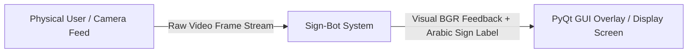

### Level 1 Data Flow Diagram
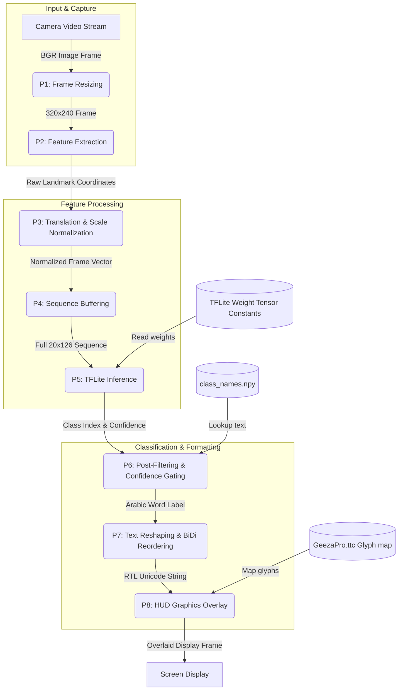

---

## 9. Deployment Architecture (Artifact 9)

The deployment architecture outlines how components run on the **Raspberry Pi 4 Model B (4GB)** hardware.

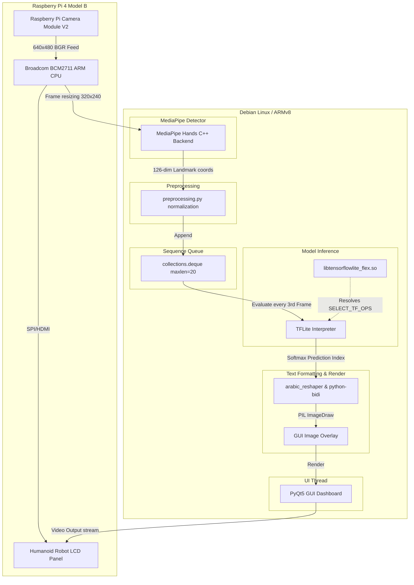

---

## 10. Mermaid Source Code (Artifact 10)

This section compiles the raw Mermaid source definitions. You can copy and paste these code blocks directly into the [Mermaid Live Editor](https://mermaid.live) or markdown renderers.

### High-Level System Architecture
```text
graph TD
    subgraph Training Phase [Google Colab T4 GPU]
        A1[KArSL-502 Video Dataset] -->|MP Hands model_complexity=0| B1(Landmark Extraction: extract_hands.py)
        B1 -->|Raw 126-dim Features| C1(Dataset Builder: build_dataset.py)
        C1 -->|Shared Norm| D1(Preprocessing Core: preprocessing.py)
        C1 -->|Padded/Truncated 20-frame seqs| E1[Consolidated Dataset ZIP]
        E1 -->|Load Dataset & Train| F1(BiLSTM Training: train_production_model.py)
        F1 -->|Export Checkpoint| G1[signbot_production_best.h5]
        G1 -->|Direct Keras Model Conversion| H1(TFLite Converter: convert_tflite_simple.py)
        H1 -->|Dynamic Range Quantization| I1[signbot_production.tflite]
    end
    subgraph Deployment Phase [Raspberry Pi 4 / Local Mac CPU]
        I1 -->|Copy TFLite Model| J2[TFLite Interpreter]
        K2[Webcam Capture Feed] -->|Frames 640x480| L2(Resolution Resize 320x240)
        L2 -->|MediaPipe Hands| M2(Landmark Detector)
        M2 -->|Extract Raw Landmarks| N2[Flat Array 126-dim]
        N2 -->|Shared Norm| O2(Preprocessing Core: preprocessing.py)
        O2 -->|Sliding Window Buffer: maxlen=20| P2(collections.deque)
        P2 -->|Every 3 Frames| J2
        J2 -->|Softmax Probability Vector| Q2(Post-processing Confidence Gates)
        Q2 -->|Arabic Shaping & RTL Layout| R2(Text Rendering: reshaper & bidi)
        R2 -->|Draw Text Glyph Overlay| S2[PyQt5 GUI / Frame Display]
    end
```

### Module Structure
```text
classDiagram
    class ConfigTraining {
        +SSD_ROOT : String
        +NPY_DIR : String
        +DATASET_DIR : String
        +NUM_CLASSES : int = 100
        +MAX_SEQUENCE_LENGTH : int = 20
        +FRAME_WIDTH : int = 320
        +FRAME_HEIGHT : int = 240
    }
    class PreprocessingCore {
        +normalize_hand_landmarks(hand_row, num_points)
        +normalize_frame(frame_hands)
        +normalize_sequence(seq_hands)
    }
    class ExtractHands {
        +find_videos()
        +extract_landmarks_from_video(video_path, hands_detector)
    }
    class BuildDataset {
        +pad_or_truncate(sequence, max_len)
        +collect_samples()
        +build_arrays(samples, split_name)
    }
    class TrainProductionModel {
        +load_signer(signer_id, split)
        +build_model()
    }
    class ConvertTfliteSimple {
        +load_model()
        +_strip_quantization_config(obj)
    }
    class TestWebcamLive {
        +draw_text(frame_bgr, text, position)
        +extract_and_normalize_hands(results)
    }
    ExtractHands --> ConfigTraining : imports
    BuildDataset --> ConfigTraining : imports
    BuildDataset --> PreprocessingCore : imports
    TrainProductionModel --> PreprocessingCore : imports
    ConvertTfliteSimple --> ConfigTraining : imports
    TestWebcamLive --> PreprocessingCore : imports
```

### Runtime Loop
```text
flowchart TD
    A[Start Runtime Script] --> B[Load TFLite Model & Class Names]
    B --> C[Initialize OpenCV VideoCapture & MediaPipe Hands]
    C --> D[Initialize collections.deque maxlen=20]
    D --> E[Read Frame from Camera]
    E -->|Success?| F{Yes}
    E -->|Failure?| G[Log Error & Exit]
    F --> H[Resize frame to 320x240]
    H --> I[Convert Frame to RGB & Run MediaPipe Hands]
    I --> J{Hands Detected?}
    J -->|Yes| K[Extract 126-dim Landmarks]
    J -->|No| L[Fill 126-dim Vector with Zeros]
    K --> M{Was prev frame empty?}
    M -->|Yes| N[Clear Deque Buffer]
    M -->|No| O[Apply preprocessing.normalize_frame]
    N --> O
    L --> O
    O --> P[Append Normalized Frame to Deque]
    P --> Q{Is Deque Buffer Full = 20?}
    Q -->|No| R[Render Listening State on HUD]
    Q -->|Yes| S{Frame Count % 3 == 0?}
    S -->|No| R
    S -->|Yes| T[Invoke TFLite Interpreter]
    T --> U[Retrieve Softmax Prediction Class & Confidence]
    U --> V{Confidence >= 0.80?}
    V -->|Yes| W[Prediction Text = Arabic Word]
    V -->|No| X{Confidence >= 0.60?}
    X -->|Yes| Y[Prediction Text = ~Arabic Word]
    X -->|No| Z[Prediction Text = ...]
    W --> AA[Shape Arabic Letter Forms: arabic_reshaper]
    Y --> AA
    Z --> AA
    AA --> AB[Reorder for RTL Display: python-bidi]
    AB --> AC[PIL ImageDraw Text Glyph Overlay on Frame]
    AC --> AD[Display BGR Frame to Screen via OpenCV / PyQt]
    AD --> AE{Key 'q' Pressed?}
    AE -->|Yes| AF[Release Camera & Close Windows]
    AE -->|No| E
    R --> AA
```

### Level 1 DFD
```text
graph TB
    subgraph Input & Capture
        D1[Camera Video Stream] -->|BGR Image Frame| P1(P1: Frame Resizing)
        P1 -->|320x240 Frame| P2(P2: Feature Extraction)
    end
    subgraph Feature Processing
        P2 -->|Raw Landmark Coordinates| P3(P3: Translation & Scale Normalization)
        P3 -->|Normalized Frame Vector| P4(P4: Sequence Buffering)
        P4 -->|Full 20x126 Sequence| P5(P5: TFLite Inference)
    end
    subgraph Classification & Formatting
        P5 -->|Class Index & Confidence| P6(P6: Post-Filtering & Confidence Gating)
        P6 -->|Arabic Word Label| P7(P7: Text Reshaping & BiDi Reordering)
        P7 -->|RTL Unicode String| P8(P8: HUD Graphics Overlay)
    end
    TFLiteStore[(TFLite Weight Tensor Constants)] -->|Read weights| P5
    LabelStore[(class_names.npy)] -->|Lookup text| P6
    FontStore[(GeezaPro.ttc Glyph map)] -->|Map glyphs| P8
    P8 -->|Overlaid Display Frame| OutputDisplay[Screen Display]
```

---

## 11. PlantUML Source Code (Artifact 11)

This compiles the UML standard representation in PlantUML markup. You can copy these definitions directly into tools like PlantText or local PlantUML compilation runners.

### High-Level Component Diagram
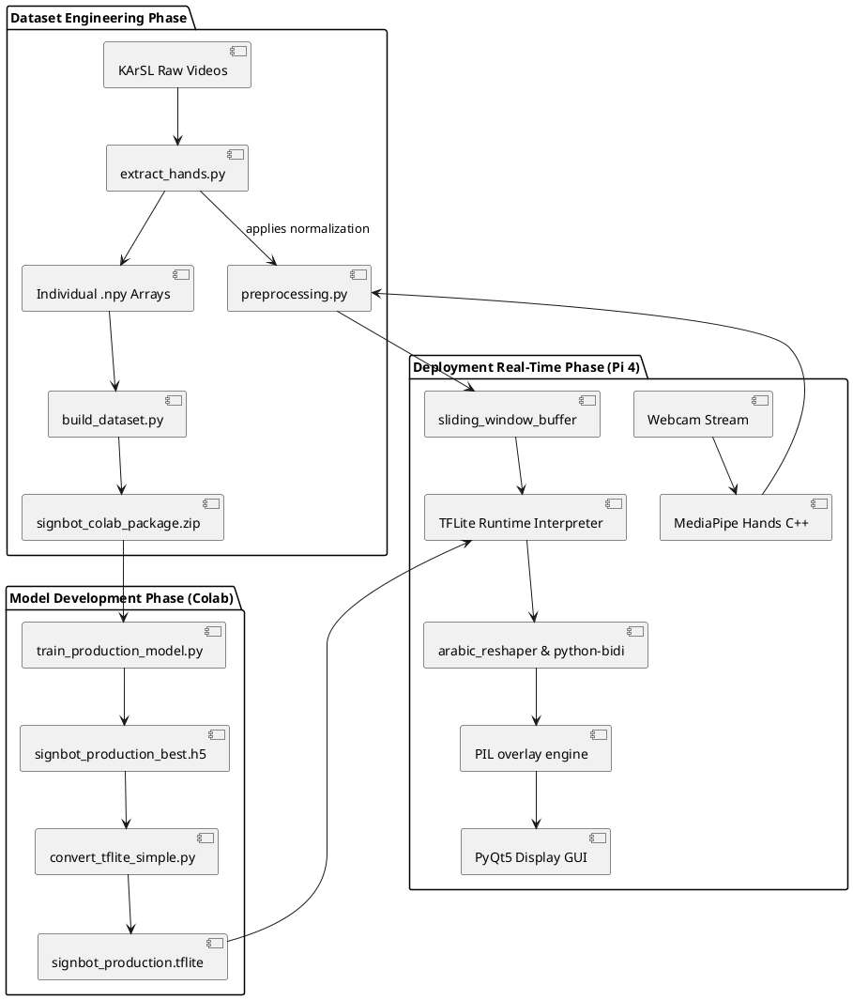

### Module Structure Class Diagram
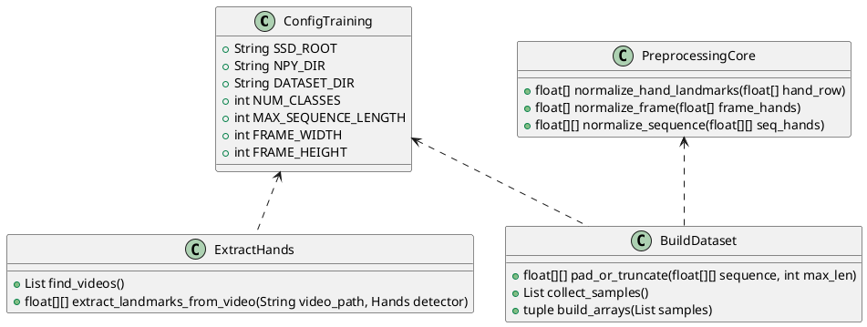

### Execution Sequence Diagram
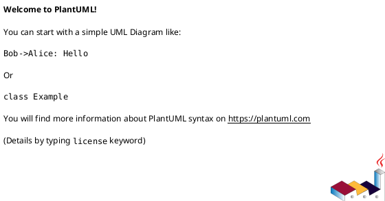

---

## 12. Engineering Documentation (Artifact 12)

### Architectural Inconsistencies and Corrections (V3)
The codebase shows a deliberate revision to fix severe, silent bugs that existed in earlier iterations of the pipeline:

1. **Holistic to Hands Alignment**: The original pipeline extracted landmark structures via MediaPipe Holistic (159 features) but deployed using MediaPipe Hands (126 features). This generated a coordinate domain gap. The V3 pipeline resolves this mismatch by enforcing `mp.solutions.hands` at both extraction (`extract_hands.py`) and inference (`test_webcam_live.py`).
2. **Elimination of Tracker Leakage**: Previously, a single MediaPipe detector instance was shared globally across all 15,099 training videos. This allowed internal tracking state to bleed between unrelated video clips. The revised extractor reinitializes the detector per video utilizing a context manager (`with mp.solutions.hands.Hands(...) as hands_detector`).
3. **Data Leakage Fix**: The initial codebase used the held-out test dataset `X_test` for callback validation during epoch loops. The V3 builder introduces a proper, stratified $15\%$ validation split carved strictly from the training partition:
   $$\text{X\_train\_all} \xrightarrow{\text{15\% Stratified Split}} \{\text{X\_train}, \text{X\_val}\}$$
4. **Enforcing Recurrent Layer Masking**: A `Masking(mask_value=0.0)` layer was added. Zero padding applied to variable-length sequences to enforce the 20-frame limit is now ignored by the bidirectional LSTMs, preventing padded frames from corrupting recurrent state.
5. **CuDNN Incompatibility Fix**: When combining a `Masking` layer with a BiLSTM on GPU, TensorFlow raises a runtime crash. Enforcing `use_cudnn=False` bypasses the CuDNN kernels and allows the model to train and evaluate stably across both Cloud and Edge architectures.
6. **Direct TFLite Weight Embedding**: Standard conversion using custom tracing produced `.tflite` files that were missing weight matrices entirely. Enforcing direct conversion (`TFLiteConverter.from_keras_model(model)`) correctly freezes LSTM variables into weight constants.

### TFLite Quantization and Ops Requirements
- **Dynamic Range Quantization**: Applied via `converter.optimizations = [tf.lite.Optimize.DEFAULT]`. This reduces weight precision from 32-bit floats to 8-bit integers, compressing model size from 5.1 MB to **0.56 MB (584 KB)** with minimal accuracy loss.
- **Select TF Ops (Flex Delegate)**: The BiLSTM layer uses advanced sequence operators not natively supported by the lightweight TFLite runtime. The compiler enforces:
  ```python
  converter.target_spec.supported_ops = [
      tf.lite.OpsSet.TFLITE_BUILTINS,
      tf.lite.OpsSet.SELECT_TF_OPS,
  ]
  ```
  Therefore, the deployment environment on the Raspberry Pi 4 Model B must load the Flex delegate library (`libtensorflowlite_flex.so`) to process these operators.
